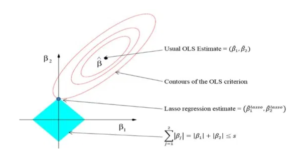

## Predictive Modeling For Insulin Resistance Using the NHANES Data

**Team member (alphabetical order):** Jack Kang, Peilu Wang, Rui Song, Sophie Kang

**Assigned TA:** Santiago Romero-Brufau

### **Background**
Insulin resistance is an important component of metabolic syndrome and often precedes the development of type II diabetes. Mounting evidence suggests that insulin resistance could promote carcinogenesis and cancer progression (Wilcox, G., 2005. Insulin and insulin resistance. Clinical biochemist reviews, 26(2), p.19). The diagnosis of insulin resistance relies on invasive tests and the symptoms of insulin resistance could be easily overlooked (Wallace, T.M. and Matthews, D.R., 2002. The assessment of insulin resistance in man. Diabetic Medicine, 19(7), pp.527-534). We proposed to develop prediction models to predict insulin resistance, measured by [**Homeostatic model assessment (HOMA)**](https://en.wikipedia.org/wiki/Homeostatic_model_assessment).

### **Motivation**
We are interested in learning and developing prediction models for anthropometric measures or chronic diseases. We chose insulin resistance as our outcome because it is mechanistically associated with various diseases, including cardiometabolic diseases, liver diseases, and cancer development. Although the condition is reversible to some extent, its diagnosis largely relies on invasive testing. A parsimonious model with easy-to-access variables could be useful to predict insulin resistance in large scale epidemiological studies. 

### **Objectives**
**Project goals:** We aimed to develop a prediction model for HOMA among general US population and examine if demographic factors, lifestyle factors, anthropometric measures, and laboratory measures could yield an accurate prediction. 

**Skills/features:** We will learn to (1) manipulate data sets with complex sampling schemes, (2) develop prediction models for both continuous and binary response variable, and (3) evaluate the performance of the prediction models.

### **Data**
We used National Health and Nutrition Examination Survey (NHANES) 2009-2010 cycle to develop prediction models for Insulin Resistance among general US population.

**Inclusion criteria:** Adults (age>=18 years old) who participated in the NHANES 2009-2010 cycle.

**Exclusion criteria:** (1) Pregnant during the questionnaire cycle; (2) Previous diagnosis of diabetes or taking anti-diabetic medications (pills or insulin); (3) Missing the response variable (i.e. HOMA-IR) and/or predictors.

**Variables:**
We considered demographic and lifestyle factors from questionnaires, physical examination measures, and laboratory measures.


### Data Wrangling 
```{r, echo=FALSE, message = FALSE}
require(nhanesA)
require(knitr)
require(SASxport)
require(dplyr)
require(plyr)
require(foreign)
require(survey)
require(ggplot2)
require(ggeffects)
library(caret)
library(glmnet)
library(tidyverse)
library(e1071)
library(pROC)
library(PerformanceAnalytics)
library(corrplot)
```

##### **Demographics Data supplies**
* SEQN (identifier for participant), 
* Weight_MEC: Full Sample 2 Year MEC Exam Weight, 
* Variance_PSU: Masked Variance Pseudo-PSU, 
* Variance_Stratum:  Masked Variance Pseudo-Stratum,
* Gender: 1=male, 2=female,
* Age, 
* Race: Race/Ethnicity 1=Mexican American, 2=other Hispanic, 3=Non-Hispanic White, 4=Non-Hispanic Black, 5=other race, 
* Education: Education Level, 1 = less than High school, 2 = High school diploma or GED, 3 = more than high school,
* Income_ratio: Ratio of family income to poverty, 1 = [0 - 1], 2 = (1, 2], 3 = (2, 4], 4 = (4, +).

```{r}
# Demographic data 
demo_data <- foreign::read.xport("./data_set/DEMO_F.xpt") %>% 
  select ("SEQN", # Respondent sequence number
           "RIAGENDR", # Gender 1=male, 2=female
           "RIDAGEYR", # Age at Screening Adjudicated  
           "RIDRETH1", # Race/Ethnicity 1=Mexican American, 2=other Hispanic, 3=NHW, 4=NHB, 5=other race
           "DMDEDUC3", # Education Level - Children/Youth 6-19
           "DMDEDUC2", # Education Level - Adults 20+ 
           "INDHHIN2", # Annual Household Income 1-15, 77=refused, 99=unknown, .=missing
           "INDFMPIR", # ratio of family income to poverty, 5 =value>=5
           "WTMEC2YR", # Full Sample 2 Year MEC Exam Weight 
           "SDMVPSU", # Masked Variance Pseudo-PSU  
           "SDMVSTRA") # Masked Variance Pseudo-Stratum
colnames(demo_data) <- c("SEQN", "Gender", "Age", "Race", "Education_youth",
                         "Education_adult", "Income", "Income_ratio", "Weight_MEC", 
                         "Variance_PSU", "Variance_Stratum")

demo_data <- demo_data %>% mutate(
  Education_youth=case_when(
    Education_youth<=12 ~ 1, # less than high school
    Education_youth %in% c(13,14) ~ 2, # high school diploma or GED
    Education_youth ==15 ~ 3, # more than high school
    TRUE ~ NA_real_), 
  Education=case_when(
    Education_adult %in% c(1,2) ~ 1, # less than high school
    Education_adult ==3 ~ 2, # high school diploma or GED
    Education_adult %in% c(4,5) ~ 3, # more than high school
    is.na(Education_adult) ~ Education_youth), 
  Income_ratio=case_when(
    Income_ratio<=1 ~ 1, # under the poverty line
    Income_ratio<=2 ~ 2,
    Income_ratio<=4 ~ 3,
    Income_ratio>4 ~ 4,
    TRUE ~ NA_real_)
  ) %>% 
  mutate(
    Education = factor(Education,
                       levels = c(1,2,3),
                       labels = c("less than High school", 
                                  "High school diploma or GED", 
                                  "more than high school")),
    Income_ratio = factor(Income_ratio,
                          levels = c(1,2,3,4),
                          labels = c("[0 - 1]", "(1, 2]", "(2, 4]", "(4, +)")),
    Gender = factor(Gender,
                    levels = c(1,2),
                    labels = c("male", "female")),
    Race = factor(Race,
                  levels = c(1,2,3,4,5),
                  labels = c("Mexican American", "other Hispanic", "NHW", "NHB", "other race"))
  ) %>% select("SEQN", "Gender", "Age", "Race", 
                         "Education", "Income_ratio", "Weight_MEC", 
                         "Variance_PSU", "Variance_Stratum")

colnames(demo_data)
head(demo_data)
```

##### **Lab Data supplies**
* SEQN, 
* Weight_fasting: fasting subsample 2 year MEC weight, 
* Weight_ogtt: OGTT subsample 2 year MEC weight,
* ACR_random: albumin creatine ratio (mg/g) random urine, 
* ACR_void: ACR (mg/g) first morning void urine, 
* HDL_C_mmol: Total Cholesterol (mmol/L), (HDL_C_mg: Direct HDL-Cholesterol (mg/dL)) , 
* TC_mmol: Total Cholesterol (mmol/L), (TC_mg: Total Cholesterol (mg/dL)), 
* CRP: C-reactive protein (mg/dL), 
* WBC: white blood cell count (1000 cells/uL), 
* HbA1c: Glycohemoglobin (%), 
* pregtest: pregnant 1= yes, 0 = no or unknown,
* ApoB_mg(fasting): Apolipoprotein B, mg/dL,
* TG_mmol(fasting): Triglyceride (mmol/L), (TG_mg(fasting): Triglyceride (mg/dL))
* LDL_C_mmol(fasting): LDL-cholesterol (mmol/L), (LDL_C_mg(fasting): LDL-cholesterol (mg/dL)),
* FG_mmol(fasting): Fasting Glucose (mmol/L), (FG_mg(fasting): Fasting Glucose (mg/dL)),
* Insulin_pmol(fasting): Insulin (pmol/L), (Insulin_uU(fasting): Insulin (uU/mL)),
* ogtt_mmol(ogtt): 2h-Glucose (mmol/L),(ogtt_mg(ogtt): 2h-Glucose (mg/dL)),
* TC_HDL_ratio: Total cholesterol/HDL-cholesterol ratio, 
* HOMA_IR (fasting): HOMA of insulin resistance (HOMA-IR) index, 
* TyG (fasting): Triglyceride glucose (TyG) index, 
* HOMA_b (fasting): HOMA of β-cell function (HOMA-B) index.

```{r, eval=TRUE}
## Labs data 
# Urine Albumin & Creatinine
acr_data <- foreign::read.xport("./data_set/ALB_CR_F.xpt") %>% 
  select("SEQN",
          "URDACT",#albumin creatine ratio (mg/g) random urine
          "URDACT2" #ACR (mg/g) first morning void urine
          )
colnames(acr_data) <- c("SEQN", "ACR_random", "ACR_void")

# ApoB
apoB_data <- foreign::read.xport("./data_set/ApoB_F.xpt") %>% 
  select("SEQN",
           "WTSAF2YR", # fasting subsample 2 year MEC weight
           "LBXAPB" # Apolipoprotein B, mg/dL
            )
colnames(apoB_data) <- c("SEQN", "Weight_fasting", "ApoB_mg")

# Cholesterol - HDLs
hdl_data <- foreign::read.xport("./data_set/HDL_F.xpt") %>% 
  select("SEQN",
           "LBDHDD", # Direct HDL-Cholesterol (mg/dL)
           "LBDHDDSI") # Direct HDL-Cholesterol (mmol/L)
colnames(hdl_data) <- c("SEQN", "HDL_C_mg", "HDL_C_mmol")

# LDL & Triglycerides
ldl_TC_data <- foreign::read.xport("./data_set/TRIGLY_F.xpt") %>% 
  select("SEQN",
           "WTSAF2YR", # fasting weight
           "LBXTR", # Triglyceride (mg/dL)
           "LBDTRSI", # Triglyceride (mmol/L)
           "LBDLDL", # LDL-cholesterol (mg/dL)
           "LBDLDLSI") # LDL-cholesterol (mmol/L)
colnames(ldl_TC_data) <- c("SEQN", "Weight_fasting", "TG_mg", "TG_mmol",
                           "LDL_C_mg", "LDL_C_mmol")

# Total Cholesterol
tc_data <- foreign::read.xport("./data_set/TCHOL_F.xpt") %>% 
  select("SEQN",
          "LBXTC", # Total Cholesterol (mg/dL)
          "LBDTCSI") # Total Cholesterol (mmol/L)
colnames(tc_data) <- c("SEQN", "TC_mg", "TC_mmol")

# WBC (one paper found WBC count predicts IR)
cbc_data <- foreign::read.xport("./data_set/CBC_F.xpt") %>% 
  select("SEQN",
           "LBXWBCSI" # white blood cell count (1000 cells/uL)
          ) 
colnames(cbc_data) <- c("SEQN", "WBC")

# CRP
crp_data <- foreign::read.xport("./data_set/CRP_F.xpt") %>% 
  select("SEQN",
           "LBXCRP"# C-reactive protein (mg/dL)
          ) 
colnames(crp_data) <- c("SEQN", "CRP")

# HbA1c (could be used to excl. those wtih T2DM)
ghb_data <- foreign::read.xport("./data_set/GHB_F.xpt") %>% 
  select("SEQN",
           "LBXGH" # Glycohemoglobin (%)
          )
colnames(ghb_data) <- c("SEQN", "HbA1c")

# OGTT (could be used to excl. those wtih T2DM)
ogtt_data <- foreign::read.xport("./data_set/OGTT_F.xpt") %>% 
  select("SEQN",
           "WTSOG2YR", # OGTT subsample 2 year MEC weight
           "LBXGLT", # 2h-Glucose (mg/dL)
           "LBDGLTSI" # 2h-Glucose (mmol/L)
         ) 
colnames(ogtt_data) <- c("SEQN", "Weight_ogtt", "ogtt_mg", "ogtt_mmol")

# Plasma Fasting Glucose & Insulin
FPI_FPG_data <- foreign::read.xport("./data_set/GLU_F.xpt") %>% 
  select("SEQN",
           "WTSAF2YR", # fasting subsample 2 year MEC weight
           "LBXGLU", # Fasting Glucose (mg/dL)
           "LBDGLUSI", # Fasting Glucose (mmol/L)
           "LBDINSI", # Insulin (pmol/L)
           "LBXIN") #Insulin (uU/mL)
colnames(FPI_FPG_data) <- c("SEQN", "Weight_fasting", "FG_mg",
                            "FG_mmol", "Insulin_pmol", "Insulin_uU")

# pregnancy test (for exclusion)
preg_data <- foreign::read.xport("./data_set/UCPREG_F.xpt") %>% 
  select("SEQN",
         "URXPREG" # pregnancy test result
          ) 
colnames(preg_data) <- c("SEQN", "pregtest")
preg_data <- preg_data %>% mutate(pregtest = case_when(
  pregtest == 1 ~ 1,
  TRUE ~ 0))

# merging lab data 
lab_data <- join_all(list(acr_data, apoB_data, hdl_data, ldl_TC_data, tc_data, cbc_data,
                          crp_data, ghb_data, ogtt_data, FPI_FPG_data, preg_data),
                    by = "SEQN", type = "full")

lab_data <- lab_data %>% mutate(TC_HDL_ratio = TC_mmol / HDL_C_mmol,
                                HOMA_IR = FG_mmol * Insulin_uU / 22.5,
                                TyG = log(TG_mg*FG_mg/2),
                                HOMA_b = 20*Insulin_uU/(FG_mmol-3.5)) %>% 
             select(-c(HDL_C_mg,LDL_C_mg,TC_mg,TG_mg, ogtt_mg,FG_mg,Insulin_uU))
colnames(lab_data)
head(lab_data)
```

##### **Examination Data supplies**
* SEQN,
* Weight: Weight (kg), 
* Height: Standing Height (cm), 
* BMI: Body Mass Index (kg/m**2), 
* Waist_Circ: Waist Circumference (cm), 
* Arm_Circ: Arm Circumference (cm), 
* Triceps_skinfold: Triceps Skinfold (mm), 
* Subscapular_skinfold: Subscapular Skinfold (mm),
* SBP_avg: Systolic: Blood pres (1st rdg) mm Hg, 
* DBP_avg: Diastolic: Blood pres (1st rdg) mm Hg, 
* FENO: 2 reproducible FENO(fractional exhaled nitric oxide) measure (parts per billion), 
* FVC: baseline FVC (mL), 
* FEV1: baseline forced expiratory volume in the 1st second, mL, 
* FEV1_percent: FEV1/FVC.

```{r, eval= TRUE}
# Anthropometric measures
body_data <- foreign::read.xport("./data_set/BMX_F.xpt") %>% 
  select("SEQN", 
          "BMXWT", # Weight (kg)
          "BMXHT", # Standing Height (cm)
          "BMXBMI", # Body Mass Index (kg/m**2)
          "BMXWAIST", # Waist Circumference (cm)
          "BMXARMC", # Arm Circumference (cm)
          "BMXTRI", # Triceps Skinfold (mm)
          "BMXSUB") # Subscapular Skinfold (mm)
colnames(body_data) <- c("SEQN", "Weight", "Height", "BMI", "Waist_Circ", 
                         "Arm_Circ", "Triceps_skinfold", "Subscapular_skinfold")

bp_data <- foreign::read.xport("./data_set/BPX_F.xpt") %>% 
  select("SEQN",
          "BPXSY1", # Systolic: Blood pres (1st rdg) mm Hg
          "BPXDI1", # Diastolic: Blood pres (1st rdg) mm Hg
          "BPXSY2", # Systolic: Blood pres (2nd rdg) mm Hg
          "BPXDI2", # Diastolic: Blood pres (2nd rdg) mm Hg
          "BPXSY3", # Systolic: Blood pres (3rd rdg) mm Hg
          "BPXDI3", # Diastolic: Blood pres (3rd rdg) mm Hg
          "BPXSY4", # Systolic: Blood pres (4th rdg) mm Hg
          "BPXDI4") # Diastolic: Blood pres (4th rdg) mm Hg))
colnames(bp_data) <- c("SEQN","Systolic_bp_1", "Diastolic_bp_1",
                       "Systolic_bp_2", "Diastolic_bp_2",
                       "Systolic_bp_3", "Diastolic_bp_3",
                       "Systolic_bp_4", "Diastolic_bp_4")
bp_data<-bp_data %>% mutate(
  SBP_avg = rowMeans(select(.,starts_with("Systolic")),na.rm = TRUE),
  DBP_avg = rowMeans(select(.,starts_with("Diastolic")),na.rm = TRUE)
  ) %>% select(SEQN, SBP_avg, DBP_avg)

# Spirometry (fractional exhaled nitric oxide)
enx_data <- foreign::read.xport("./data_set/ENX_F.xpt") %>% 
  select("SEQN", "ENXMEAN") # 2 reproducible FENO measure (parts per billion)
colnames(enx_data) <- c("SEQN", "FENO")

spx_data <- foreign::read.xport("./data_set/SPX_F.xpt") %>% 
  select("SEQN",
         "SPXNFVC", # baseline FVC (mL)
         "SPXNFEV1" # baseline forced expiratory volume in the 1st second, mL
         ) %>% 
  mutate(FEV1_percent=SPXNFEV1/SPXNFVC)
colnames(spx_data) <- c("SEQN", "FVC", "FEV1", "FEV1_percent")

exam_data <- join_all(list(body_data, bp_data, enx_data, spx_data),
                    by = "SEQN", type = "full")

colnames(exam_data)
head(exam_data)
```

##### **Questionnaires supplies**
* SEQN, 
* DM_hx: Doctor told you have diabetes, 1=yes, 0 =no or unknown, 
* DM_insulin: taking insulin now, 1=yes, 0 =no or unknown,
* DM_pill: taking diabetic pills, 1=yes, 0 =no or unknown,
* preDM: ever told have prediabetes, 1=yes, 0 =no or unknown,
* Alcohol: average alcoholic drinks/day - past 12mo, 
* CVD: ever told had congestive heart failure, coronary heart disease, heart attack, stroke, or angina pectoris, 1=yes, 0 =no or unknown,
* Cancer:ever told had cancer, 1=yes, 0 =no or unknown,
* DM_fhx: close relative had diabetes,1=yes, 0 =no or unknown,
* sedentary_min: minutes sedentary activity per day, 
* modrec_min: minutes moderate recreational activities per day, 
* vigrec_min: minutes vigorous recreational activities per day, 
* transport_min: minutes walk/bicycle for transportation per day, 
* modwork_min: minutes moderate-intensity work per day, 
* vigwork_min: minutes vigorous-intensity work per day, 
* met_score: MET score developed based on activity could be excluded due to low variability, 
* smoking: smoked at least 100 cigareettes, 1 =yes, 0 = no.  

```{r, eval=TRUE}
#Diabetes 
diabetes_data <- foreign::read.xport("./data_set/DIQ_F.xpt") %>% 
  select("SEQN",
        "DIQ010", # Doctor told you have diabetes
        "DIQ050", # taking insulin now
        "DIQ070", # taking diabetic pills
        "DIQ160" # ever told have prediabetes
        ) 
colnames(diabetes_data) <- c("SEQN","DM_hx", "DM_insulin", "DM_pill", "preDM")
diabetes_data <- diabetes_data %>% mutate(
  DM_hx = case_when(
    DM_hx == 1 ~ 1,
    TRUE ~ 0
  ),
  DM_insulin = case_when(
    DM_insulin == 1 ~ 1,
    TRUE ~ 0
  ),
  DM_pill = case_when(
    DM_pill == 1 ~ 1,
    TRUE ~ 0
  ),
  preDM = case_when(
    preDM == 1 ~ 1,
    TRUE ~ 0
  )
)

# alcohol use
alc_data <- foreign::read.xport("./data_set/ALQ_F.xpt") %>% 
  select("SEQN","ALQ130")  # average alcoholic drinks/day - past 12mo
colnames(alc_data) <- c("SEQN","Alcohol")
alc_data <- alc_data %>% mutate(Alcohol=case_when(
  Alcohol %in% c(777,999) ~ NA_real_,
  TRUE ~ Alcohol
))

# medical conditions
mcq_data <- foreign::read.xport("./data_set/MCQ_F.xpt") %>% 
  select("SEQN",
         "MCQ160B", # ever told had congestive heart failure
         "MCQ160C", # ever told had CHD
         "MCQ160D", # ever told had angina pectoris
         "MCQ160E", # ever told had heart attack
         "MCQ160F", # ever told had stroke
         "MCQ220", # ever told had cancer
         "MCQ300C" # close relative had diabetes
        )  
colnames(mcq_data) <- c("SEQN","CHF", "CHD", "angina", "MI", "stroke", "cancer", "DM_fhx")
mcq_data <- mcq_data %>% mutate(
  CVD =case_when(
    CHF==1|CHD==1|angina==1|MI==1|stroke==1 ~ 1,
    TRUE ~ 0
  ),
  cancer = case_when(
    cancer == 1 ~ 1,
    TRUE ~ 0
  ),
  DM_fhx = case_when(
    DM_fhx == 1 ~ 1,
    TRUE ~ 0
  )
)

# physical activity
paq_data <- foreign::read.xport("./data_set/PAQ_F.xpt") %>% 
  select("SEQN",
         "PAD680", # minutes sedentary activity per day
         "PAD675", # minutes moderate recreational activities per day
         "PAD660", # minutes vigorous recreational activities per day
         "PAD645", # minutes walk/bicycle for transportation per day
         "PAD630", # minutes moderate-intensity work per day
         "PAD615" # minutes vigorous-intensity work per day
        )  %>% 
  mutate(
    PAD680 = case_when(
      PAD680 %in% c(7777, 9999) ~ NA_real_,
      TRUE ~ PAD680
    ),
    PAD675 = case_when(
      PAD675 %in% c(7777, 9999) ~ NA_real_,
      TRUE ~ PAD675
    ),
    PAD660 = case_when(
      PAD660 %in% c(7777, 9999) ~ NA_real_,
      TRUE ~ PAD660
    ),
    PAD645 = case_when(
      PAD645 %in% c(7777, 9999) ~ NA_real_,
      TRUE ~ PAD645
    ),
    PAD630 = case_when(
      PAD630 %in% c(7777, 9999) ~ NA_real_,
      TRUE ~ PAD630
    ),
    PAD615 = case_when(
      PAD615 %in% c(7777, 9999) ~ NA_real_,
      TRUE ~ PAD615
    )
  )
colnames(paq_data) <- c("SEQN","sedentary_min", "modrec_min", "vigrec_min", "transport_min", 
                        "modwork_min", "vigwork_min")
paq_data <- paq_data %>% mutate(
  met_score = sum(modrec_min*4, vigrec_min*8, transport_min*4,
                  modwork_min*4, vigwork_min*8, na.rm = TRUE)/(60*24*7) # MET/week
)

# smoking 
smq_data <- foreign::read.xport("./data_set/SMQ_F.xpt") %>% 
  select("SEQN",
         "SMQ020")  # smoked at least 100 cigareettes
colnames(smq_data) <- c("SEQN","smoking")
smq_data<- smq_data %>% mutate(smoking = case_when(
  smoking %in% c(2,7,9) ~ 0,
  TRUE ~ smoking
))

questionnaire_data <- join_all(list(diabetes_data, alc_data, mcq_data, paq_data, smq_data),
                    by = "SEQN", type = "full") %>% select(-c("CHF", "CHD", "angina", "MI", "stroke"))

colnames(questionnaire_data)
head(questionnaire_data)
```

##### **Data set**
* `merge_data` contains all the variables and all the participants in 2009-2010 cycle.
* `NHANES` is a survey design object subsetting those who were >=18 years and had no diabetes history or taking relevant medications.

```{r all variables}

# merge data 
merge_data <- join_all(list(demo_data, lab_data, exam_data, questionnaire_data),
                       by = "SEQN", type = "full") %>% mutate(
                         inAnalysis = (Age >= 18 & (pregtest != 1 | is.na(pregtest)) & 
                                         (DM_hx !=1 | is.na(DM_hx)) & (DM_insulin !=1 |is.na(DM_insulin)) & 
                                         (DM_pill !=1 | is.na(DM_pill)) & !is.na(HOMA_IR)
                                         )
                       )
write.csv(merge_data,'merge_data.csv')

# define survey design
NHANES_all <- svydesign(data=merge_data, id = ~ Variance_PSU, strata = ~ Variance_Stratum,
                        weights = ~ Weight_MEC, nest = TRUE)
NHANES <- subset(NHANES_all, inAnalysis == 1)

### clean data for simple modeling
clean <- merge_data %>% filter(inAnalysis == 1) %>% select(-c(DM_pill,DM_hx,DM_pill))
write.csv(clean,'clean.csv')
```

##### **Subset useful variables and drop missingness**
We excluded variables that are related to individual identity (e.g. ID identifier, sampling information) and that are the same across all subjects, including met_score, DM_insulin, pregtest, as well as variables that are deterministic to our outcome of interest (i.e. FG_mmol and Insulin_pmol). In addition, we do not want to use variables that have high level of missingness (defined as as missing over 20% of values). Finally, 37 covariates are selected to feed into our prediction model.

```{r}
clean_data_all <- read.csv("clean.csv")
clean_data <- clean_data_all %>% 
  select(-c(X,SEQN,inAnalysis,met_score,DM_insulin,pregtest,FG_mmol,Insulin_pmol,Weight_ogtt,
            HOMA_b,Weight_MEC,Variance_Stratum,Variance_PSU,Weight_fasting)) 

missing <- apply(is.na(clean_data)/dim(clean_data)[1], 2, sum)
all_Var <- names(missing)[missing<0.2]

dat1 <- clean_data %>% select(all_of(all_Var))
final <- dat1[complete.cases(dat1),]
```

#### **EDA**
##### **Summary Baseline Characteristics**
We had a total of 1121 available subjects with information across 37 covariates. 
Among the study population, we had 50.8% female and 49.2% male individuals. The average age of the study population was 46.5 years old with a standard deviation of 16. 
The mean HOMA-IR value, which was calculated as 
$$HOMA=\frac{FPI * FPG}{22.5}$$ where FPI = fasting plasma insulin (mU/L), FPG = fasting plasma glucose (mmol/L)
was 2.94 among the study population with a standard deviation of 2.4. There were 4.5% of the people under the pre-diabetes condition at baseline.

```{r, message = FALSE, results = "asis"}
# unweighted table - check missing pattern
require(arsenal)
eda <- final
eda$preDM <- as.factor(eda$preDM)
eda$cancer <- as.factor(eda$cancer)
eda$DM_fhx <- as.factor(eda$DM_fhx)
eda$CVD <- as.factor(eda$CVD)
eda$smoking <- as.factor(eda$smoking)

summary(tableby(~., data = eda), title = "**Baseline Summary Statistics For Variables**")

# Define a function to call svymean and unweighted count
getSummary <- function(varformula, byformula, design){
  # Get mean, stderr, and unweighted sample size
  c <- svyby(varformula, byformula, design, unwtd.count ) 
  p <- svyby(varformula, byformula, design, svymean ) 
  outSum <- left_join(select(c,-se), p) 
  outSum
}
```

##### **Boxplots of HOMA-IR Comparing Across Demographic Variables** 
The boxplots show how different levels of each demographic variable affecting the HOMA-IR. For categorical variables - gender, race, education level, income level - we made boxplots for these variables vs. HOMA-IR. The distributions of HOMA-IR were similar across gender, race, education level, and income level.
```{r}
# boxplots for categorical variables - HOMA-IR 
# Gender
p_gender <- eda %>% ggplot(aes(Gender, HOMA_IR, fill=Gender)) +
                           geom_boxplot() +
                           scale_y_continuous(trans = "log10") +
                           ggtitle("HOMA-IR by Gender") +
                           ylab("HOMA-IR (log10 scale)") +
                           scale_fill_brewer(palette="Pastel1") +
                           theme(axis.title.x=element_blank(),
                                 axis.text.x=element_blank(),
                                 axis.ticks.x=element_blank())
p_gender

# Race
p_race <- eda %>% ggplot(aes(Race, HOMA_IR, fill=Race)) +
                         geom_boxplot() +
                         scale_y_continuous(trans = "log10") +
                         ggtitle("HOMA-IR by Race") +
                         ylab("HOMA-IR (log10 scale)") +
                         scale_fill_brewer(palette="Set3") +
                         theme(axis.title.x=element_blank(),
                               axis.text.x=element_blank(),
                               axis.ticks.x=element_blank())
p_race

# Education Level
p_edu <- eda %>% ggplot(aes(Education, HOMA_IR, fill=Education)) +
                        geom_boxplot() +
                        scale_y_continuous(trans = "log10") +
                        ggtitle("HOMA-IR by Education Level") +
                        ylab("HOMA-IR (log10 scale)") +
                        scale_fill_brewer(palette="Accent") +
                        theme(axis.title.x=element_blank(),
                              axis.text.x=element_blank(),
                              axis.ticks.x=element_blank())
p_edu

# Income level
p_income <- eda %>% ggplot(aes(Income_ratio, HOMA_IR, fill=Income_ratio)) +
                           geom_boxplot() +
                           scale_y_continuous(trans = "log10") +
                           ggtitle("HOMA-IR by Income Level") +
                           ylab("HOMA-IR (log10 scale)") +
                           scale_fill_brewer(palette="Set2") +
                           theme(axis.title.x=element_blank(),
                                 axis.text.x=element_blank(),
                                 axis.ticks.x=element_blank()) +
                           scale_fill_discrete(name = "Ratio of family income \n to poverty")
p_income 
```


##### **Scatterplot for Age Versus HOMA-IR**
The scatterplot was generated for age versus HOMA-IR value to see if age has any effect on the HOMA-IR value. From the age range of 20 to 79, there is no general pattern for HOMA-IR according to the study participants' age. 

```{r}
p_age <- eda %>% 
           ggplot(aes(Age, HOMA_IR)) +
           scale_y_continuous(trans = "log10") +
           geom_point() +
           geom_smooth(method = "lm") +
           ggtitle("HOMA-IR by Age") +
           ylab("HOMA-IR (log10 scale)") 
p_age
```

##### **Spearman correlation matrix**  

```{r}
#Correlation Matrix
dat_corr <- clean_data %>% select(-c(Gender,Race, Education, Income_ratio))
a <- cor(dat_corr, method = "spearman", use = "complete.obs")
corrplot(a, order = "hclust", tl.cex=0.5, tl.col="black", addrect = 2)
```

Above was the Spearman correlation matrix. Positive correlations were displayed in blue and negative correlations in red color. Color intensity and the size of the circle were proportional to the correlation coefficients. Variables in the same rectangles were in the same hierarchical cluster, indicating data similarities. 

### **General Approach**
The dataset was randomly split into training set (80%) and test set (20%). 

An L1 penalized binary lasso regression was conducted on multiple potential predictors to create a sparse model in order to improve the direct interpretability as well as to avoid the collinearity and overfitting of the data. To tune the regularization parameter lambda, a ten-fold cross-validation was conducted, in which the training dataset was split into ten uniformly sized chunks. One of the ten chunks was used for validation and the rest was used for training for each time. We evaluated the performance of the binary lasso model in the test dataset through accuracy, sensitivity, specificity, and ROC. 

Then, a k-nearest neighbors (KNN) model was conducted for the binary outcome. The parameter k was selected through ten-fold validation. Same metrics were used to evaluate the performance of the binary KNN model in the test set. Moreover, lasso and KNN models were also conducted for continuous HOMA-IR. RMSE in test set was calculated for the evaluation of continuous models.


##### **Lasso** 
One key feature of LASSO is that it can perform feature selection by shrinking non-significant coefficients to zero. Thus, the remaining predictors with non-zero coefficients are significant.

The goal of LASSO is to minimize: 

For regression: $\sum_{i=1}^n(y_i-\sum_jx_{ij}\beta_j)^2+\lambda\sum_{j=1}^p|\beta_j|$, or equivalently $\sum_{i=1}^n(y_i-\sum_jx_{ij}\beta_j)^2$ under the constraint $\sum_{j=1}^p|\beta_j|\le s$.

For classification: $L+\lambda\sum_{j=1}^p|\beta_j|$ where L = -logLikelihood



### **Results** 

#### **Predictions on Binary HOMA-IR**

##### **LASSO**

```{r}
final_bin <- final %>% 
  mutate(HOMA_b=as.factor(ifelse(HOMA_IR<=quantile(HOMA_IR,2/3),0,1))) %>%
  select(-HOMA_IR)

dim(final_bin) #About 1100 subjects remain
#Proportion of normal and insulin resistant cases
table(final_bin$HOMA_b)/dim(final_bin)[1]
```

In our whole dataset, there are 66.64% normal individuals and 33.36% insulin resistant individuals. The cutoff of HOMA-IR value to define insulin resistance is arbitrary. In our case insulin resistance is dichotomized based on the cutoff of the upper tertile of HOMA-IR test value, as suggested by the paper Sumner et.al, Ethnic differences in the ability of triglyceride levels to identify insulin resistance. Atherosclerosis.2008 Feb;196(2):696-703. PMID:17254586, which was also based on US NHANES population.  

Create training set and test set with a 4:1 partition of the data. The training set and test set have similar distribution of normal and resistant individuals. 

```{r}
set.seed(1)
train_index <- createDataPartition(final_bin$HOMA_b, times = 1, p = 0.8, list = FALSE)
train_set <- final_bin[train_index, ]
test_set <- final_bin[-train_index, ]
table(train_set$HOMA_b)/dim(train_set)[1]
table(test_set$HOMA_b)/dim(test_set)[1]
head(train_set)
```

To fit LASSO model, we need to specify the penalty parameter lambda. However, we do not know the optimal lambda. Luckily, the caret package can choose that for us through a process called cross validation. The training set is first divided into 10 equal chunks. Given a range of lambda to check, for each lambda, hold out the first chunk as test set, fit a lasso model on the remaining chunks and obtain a performance metric (accuracy by default) through prediction on the held-out set. Repeat this process ten times by holding out the first, the second, the third ..., the tenth chunk. Take the average of the performance metrics as the performance of LASSO model for the given lambda. Lastly, we choose the lambda that gives the best performance and fit our model on the whole training set with the chosen lambda.

```{r}
###Penalized logistic regression with cross validation
#Find the best lambda using cross-validation
set.seed(1)
model.lasso <- train(
  HOMA_b~., data = train_set, method = "glmnet",
  trControl = trainControl("cv", number = 10),
  tuneGrid = expand.grid(alpha=1,lambda=seq(0.001,0.5,by = 0.001)) #Range of lambda
)
#Display regression coefficients
coef(model.lasso$finalModel, model.lasso$bestTune$lambda)
#Make predictions on the test data
p_hat_logit.lasso <- predict(model.lasso ,newdata=test_set,type="prob")
prediction.lasso <- ifelse(p_hat_logit.lasso[,2]>0.5,1,0)
```

As we can see, coefficients of some variables are shrank to zero. 

Apart from confusion matrix, here we also present another criterion to evaluated prediction model performance, namely ROC (receiver operating characteristic) curve that shows the performance of a classification model at all classification thresholds. It plots true positive rate (i.e. sensitivity) against false positive rate (i.e. 1-specificity). And the area under curve (AUC) is equal to the probability that a classifier will rank a randomly chosen positive instance higher than a randomly chosen negative one. AUC ranges in value from 0 to 1. A model whose predictions are 100% wrong has an AUC of 0.0; one whose predictions are 100% correct has an AUC of 1.0.


```{r}
#Model performance statistics
confusionMatrix(data=as.factor(prediction.lasso),reference=test_set$HOMA_b,positive="1")
#Calculate AUC and draw ROC curve
roc.lasso <- roc(test_set$HOMA_b,p_hat_logit.lasso[,2])
auc(roc.lasso)
ggroc(roc.lasso,legacy.axes=T,col="red",lwd=2) +
  geom_abline(slope=1,intercept=0) + # add identity line
  theme(
    panel.background = element_blank(), 
    axis.title.x = element_text(size =18, face = 'bold'),
    axis.title.y = element_text(size =18, face = 'bold'),
    panel.border = element_rect(size = 2, fill = NA), 
    axis.text.x = element_text(size = 14, face ='bold'),
    axis.text.y = element_text(size = 14, face ='bold')) +
  xlab('100% - Specificity') +
  ylab('Sensitivity %') +
  scale_x_continuous(breaks = seq(0,1,0.25), labels = seq(0,1,0.25) * 100) + 
  scale_y_continuous(breaks = seq(0,1,0.25), labels = seq(0,1,0.25) * 100) +
  annotate("text",x=.25,y=.75,size=6,label=paste0("AUC=",round(auc(roc.lasso),4))) +
  ggtitle("ROC curve for lasso regression on binary outcome")
```

Kappa = (Observed accuracy - expected accuracy) / (1 - expected accuracy) A dumb classifier that always predicts the majority class would have Kappa=0.

Our LASSO model achieved an accuracy of 81.17% on the test set. The Kappa value and the p-value of testing whether accuracy is greater than no information rate both suggest that our model is significantly better than a ridiculous algorithm that always predicts the majority class. The sensitivity of LASSO model is about 64% and the specificity is about 90%. AUC is 0.8629.

##### **KNN**

Next we perform prediction using KNN. Again since we do not know what value of k yields best performance, we apply 10-fold cross validation and choose the k that gives the highest accuracy.

```{r}
# Fit the KNN model on the training set
set.seed(1)
model.knn <- train(
  HOMA_b~.,
  data=train_set,method="knn",
  trControl = trainControl("cv",number=10), #10-fold cross validation
  tuneGrid=expand.grid(k=c(2,3,4,seq(5,50,by=2))), #Specify possible k values to evaluate
  metric="Accuracy",
  preProcess = c("center","scale")
  )
#Plot model accuracy vs different values of k
plot(model.knn)
#Make predictions on the test data
p_hat_logit.knn <- predict(model.knn,newdata=test_set,type="prob")
prediction.knn <- ifelse(p_hat_logit.knn[,2]>0.5,1,0)
```

Make prediction on test set.
```{r}
#KNN model performance statistics
confusionMatrix(data=as.factor(prediction.knn),reference=test_set$HOMA_b,positive="1")
#Calculate KNN AUC and draw ROC curve
roc.knn <- roc(test_set$HOMA_b,p_hat_logit.knn[,2])
auc(roc.knn)
ggroc(roc.knn,legacy.axes=T,col="red",lwd=2) +
  geom_abline(slope=1,intercept=0) + # add identity line
  theme(
    panel.background = element_blank(), 
    axis.title.x = element_text(size =18, face = 'bold'),
    axis.title.y = element_text(size =18, face = 'bold'),
    panel.border = element_rect(size = 2, fill = NA), 
    axis.text.x = element_text(size = 14, face ='bold'),
    axis.text.y = element_text(size = 14, face ='bold')) +
  xlab('100% - Specificity') +
  ylab('100% - Sensitivity') +
  scale_x_continuous(breaks = seq(0,1,0.25), labels = seq(0,1,0.25) * 100) + 
  scale_y_continuous(breaks = seq(0,1,0.25), labels = seq(0,1,0.25) * 100) +
  annotate("text",x=.25,y=.75,size=6,label=paste0("AUC=",round(auc(roc.knn),4))) +
  ggtitle("ROC curve for KNN on binary outcome")
```

Our KNN model achieved an accuracy of 76.23% on the test set, which is about 5% lower than the accuracy of the LASSO model. The Kappa value and the p-value of testing whether accuracy is greater than no information rate both suggest that our KNN model is significantly better than a ridiculous algorithm that always predicts the majority class. The Kappa statistic also suggests that the KNN model is worse than the LASSO model. The sensitivity of KNN model is just 42%, which is much lower than the LASSO model and not acceptable. The specificity is about 93%. This indicates that the KNN model in effect has a high probability assigning an individual to be normal. The sensitivity and specificity are much more balanced in LASSO. The AUC of KNN is just 0.8473, which is lower compared to LASSO.

##### **KNN On LASSO-Selected Features**

The KNN model above is fitted using all potential predictors. But given that we performed LASSO, we could also feed only those variables deemed informative by LASSO to KNN, in the hope that we could remove some noises. In total, 18 variables were included for the KNN model. However, these variables were selected under the constraint of lasso, which did not guarantee a better performance for KNN compared with a KNN model on all variables.

```{r}
#Select informative variables
coef <- coef(model.lasso$finalModel, model.lasso$bestTune$lambda)
coef <- coef[coef[,1]!=0,]
coef <- names(coef)[-1]
coef[6] <- "Income_ratio"
coef[5] <- "Education"
coef[1] <- "Gender"
coef[3] <- "Race"
coef <- coef[-4]
length(coef) #Reduced to half of the predictors
formula <- as.formula(paste0("HOMA_b~",paste(coef,collapse = "+")))

# Fit the KNN model on the training set
set.seed(1)
model.knn_2 <- train(
  formula,
  data=train_set,method="knn",
  trControl = trainControl("cv",number=10), #10-fold cross validation
  tuneGrid=expand.grid(k=c(2,3,4,seq(5,50,by=2))), #Specify possible k values to evaluate
  metric="Accuracy",
  preProcess = c("center","scale")
  )
#Plot model accuracy vs different values of k
plot(model.knn_2)
#Make predictions on the test data
p_hat_logit.knn_2 <- predict(model.knn_2,newdata=test_set,type="prob")
prediction.knn_2 <- ifelse(p_hat_logit.knn_2[,2]>0.5,1,0)
```

```{r}
#KNN model performance statistics
confusionMatrix(data=as.factor(prediction.knn_2),reference=test_set$HOMA_b,positive="1")
#Calculate KNN AUC and draw ROC curve
roc.knn_2 <- roc(test_set$HOMA_b,p_hat_logit.knn_2[,2])
auc(roc.knn_2)
ggroc(roc.knn_2,legacy.axes=T,col="red",lwd=2) +
  geom_abline(slope=1,intercept=0) + # add identity line
  theme(
    panel.background = element_blank(), 
    axis.title.x = element_text(size =18, face = 'bold'),
    axis.title.y = element_text(size =18, face = 'bold'),
    panel.border = element_rect(size = 2, fill = NA), 
    axis.text.x = element_text(size = 14, face ='bold'),
    axis.text.y = element_text(size = 14, face ='bold')) +
  xlab('100% - Specificity') +
  ylab('100% - Sensitivity') +
  scale_x_continuous(breaks = seq(0,1,0.25), labels = seq(0,1,0.25) * 100) + 
  scale_y_continuous(breaks = seq(0,1,0.25), labels = seq(0,1,0.25) * 100) +
  annotate("text",x=.25,y=.75,size=6,label=paste0("AUC=",round(auc(roc.knn),4))) +
  ggtitle("ROC curve for KNN on binary outcome")
```

Surprisingly, we got the same performance as the old KNN model with all variables, although the optimization process differed as the choice of k was different.

##### **Logistic Regression**

KNN and LASSO were more complicated than logistic regression. We wondered if our model, either using KNN or LASSO was better than simple logistic regression. If they were substantially worse, we would be comfortable sticking to the simple logistic regression.

```{r}
model.logistic <- train(
  HOMA_b ~., data = train_set, method = "glm",
  trControl = trainControl("cv", number = 10),
  family = "binomial"
)
#Make predictions on the test data
p_hat_logit.logistic <- predict(model.logistic,newdata=test_set,type="prob")
prediction.logistic <- ifelse(p_hat_logit.logistic[,2]>0.5,1,0)
#Logistic model performance statistics
confusionMatrix(data=as.factor(prediction.logistic),reference=test_set$HOMA_b,positive="1")
#Calculate AUC and draw ROC curve
roc.logistic <- roc(test_set$HOMA_b,p_hat_logit.logistic[,2])
auc(roc.logistic)
```

In fact, we found that simple logistic regression has similar performance compared to LASSO. The logistic model achieved an accuracy of 79.37% on the test test, which is slightly lower than LASSO. The Kappa is about 3% lower than that of LASSO. The sensitivity and specificity of logistic model is about 66% and 86% respectively, which are fairly close to LASSO. AUC of logistic model is 0.8586, again fairly close to LASSO.

##### **Performance Based on 10-Fold Cross Validation On The Training Set**

Finally, we present a plot that compares the accuracy and Kappa of LASSO, KNN and logistic models based on cross validation results. As we can see, the performances of LASSO and logistic models are better than that of KNN, especially in terms of Kappa. The performances of LASSO and logistic models are close, which is similar to what we see in prediction using the test set.

```{r}
results <- resamples(list(lasso=model.lasso,
                          knn=model.knn,
                          logistic=model.logistic))
dotplot(results,metric=c("Accuracy","Kappa"))
```

When LASSO and logistic model have similar performance, as in our case, we would want to LASSO. Training LASSO is not very computationally expensive,  and once trained, LASSO is more parsimonious since it shrinks some coefficients to zero. Besides, in general a simpler model generalizes better in terms prediction (e.g. in our case, prediction using data from another NHANES cycle). However, it is worth pointing out that given the available predictors we collected, in our LASSO model the sensitivity and specificity are imbalanced. The sensitivity of 64% for LASSO is moderate. 

##### **Sensitivity Analysis**

A way to make the two more balanced is to change our prediction cutoff. For example, if we change the cutoff from 0.5 to 0.4, our LASSO model achieves much more balanced sensitivity and specificity, with about 2% lower overall accuracy and the same AUC.

```{r}
#LASSO
prediction.lasso <- ifelse(p_hat_logit.lasso[,2]>0.4,1,0)
#Model performance statistics
confusionMatrix(data=as.factor(prediction.lasso),reference=test_set$HOMA_b,positive="1")
#Calculate AUC and draw ROC curve
roc.lasso <- roc(test_set$HOMA_b,p_hat_logit.lasso[,2])
auc(roc.lasso)
```

Similar is true with KNN and logistic model.

```{r}
#KNN
prediction.knn<- ifelse(p_hat_logit.knn[,2]>0.4,1,0)
#Model performance statistics
confusionMatrix(data=as.factor(prediction.knn),reference=test_set$HOMA_b,positive="1")
#Calculate AUC and draw ROC curve
roc.knn <- roc(test_set$HOMA_b,p_hat_logit.knn[,2])
auc(roc.knn)
```

```{r}
#Logistic model
prediction.logistic <- ifelse(p_hat_logit.logistic[,2]>0.4,1,0)
#Model performance statistics
confusionMatrix(data=as.factor(prediction.logistic),reference=test_set$HOMA_b,positive="1")
#Calculate AUC and draw ROC curve
roc.logistic <- roc(test_set$HOMA_b,p_hat_logit.logistic[,2])
auc(roc.logistic)
```

Ultimately, what cutoff to use depends on whether we care that sensitivity and specificity are balanced. In our project, we do not have a preference concerning that balance of sensitivity and specificity so the LASSO model with cutoff as 0.5 should be fine to use as it has higher overall accuracy compared to using 0.4 as cutoff.

#### **Predictions on Continuous HOMA-IR**

##### **LASSO**

```{r}
# Split the data into training and test set
set.seed(123)
training.samples <- final$HOMA_IR %>% 
  createDataPartition(p = 0.8, list = FALSE)
train.data  <- final[training.samples, ]
test.data <- final[-training.samples, ]

# predictor variables
x <- model.matrix(HOMA_IR~., train.data)[,-1]
# outcome 
y <- train.data$HOMA_IR

# Find the best lambda using cross-validation
set.seed(123) 
cv.lasso <- cv.glmnet(x, y, alpha = 1, nfolds = 10)
plot(cv.lasso)
cv.lasso$lambda.min

# Fit the final model on the training data
model <- glmnet(x, y, alpha = 1, 
                lambda = cv.lasso$lambda.min)


# Make predictions on the test data
x.test <- model.matrix(HOMA_IR ~., test.data)[,-1]
y.test <- test.data$HOMA_IR
pred.lasso <- model %>% predict(newx = x.test)
# Selected variables and coefficients
coef.las <- data.frame(coef.name = dimnames(coef(model))[[1]], coef.value = matrix(coef(model)))
x.select <- coef.las %>% filter(coef.value != 0 & coef.name !="(Intercept)") 
x.select
# RMSE
RMSE(pred.lasso, y.test)
```

The penalty parameter was 0.05, which was picked by 10-fold validation. The lasso model picked 22 variables from original predictors. The function has chosen the first vertical line on the cross-validation plot. The RMSE was 2.24 in the test set.  

##### **KNN**

```{r}
#Use the variables selected by Lasso to feed KNN for the same train set and test set
train.data.knn <- data.frame(y, x[ , c(as.vector(x.select$coef.name))])
test.data.knn <- data.frame(y.test, x.test[ , c(as.vector(x.select$coef.name))])
```

```{r}
set.seed(123)
model.knn <- train(
  y~.,
  data=train.data.knn, method="knn",
  trControl = trainControl("cv", number=10), #10-fold cross validation
  tuneGrid=expand.grid(k=c(2,3,4,seq(5,50,by=2))), #Specify possible k values to evaluate
  metric="RMSE",
  preProcess = c("center","scale")
  )

#Plot model RMSE vs different values of k
plot(model.knn)
#Make predictions on the test data
pred.knn <- predict(model.knn, newdata=test.data.knn)
RMSE(pred.knn, y.test)
```

We used the features selected by lasso to feed a KNN model. The value of k was selected through 10 fold validation. The final RMSE was 2.35 in the test set. The performance for lasso was slightly better than KNN in terms of RMSE.

### **Conclusion**
We developed several prediction models for the binary and continuous HOMA-IR in the NHANES dataset with 1121 participants and 37 predictors. For the classification of the binary HOMA-IR, the lasso model performed better than the KNN model, with higher accuracy and a more balanced sensitivity and specificity. It also achieved a higher AUC than KNN. Compared with the simple logistic model, the lasso model only showed slightly better performance. However, given that the lasso was more parsimonious and that a simpler model generalized better in the external dataset by avoiding overfitting, we prefer the lasso model in predicting binary HOMA-IR. For the continuous model, the RMSE was relatively large for both the lasso and the knn model. Since the classification of insulin resistance condition could be a more relevant clinical question that the general population would care about, we suggest implementing the binary lasso model for the prediction of insulin resistance.

shiny/
original dataset/
picture/
clean data.csv
final report.rmd
final report.html
README